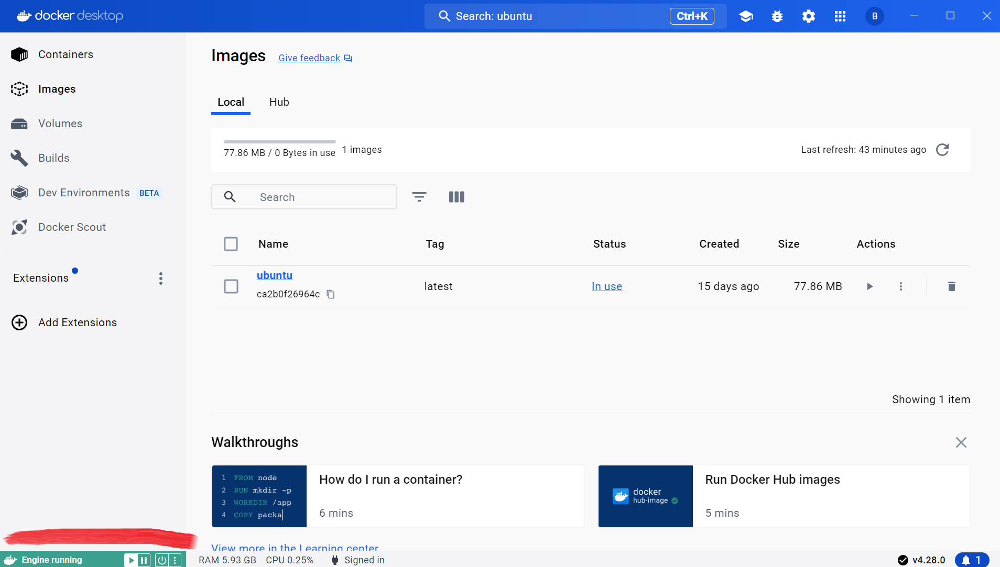
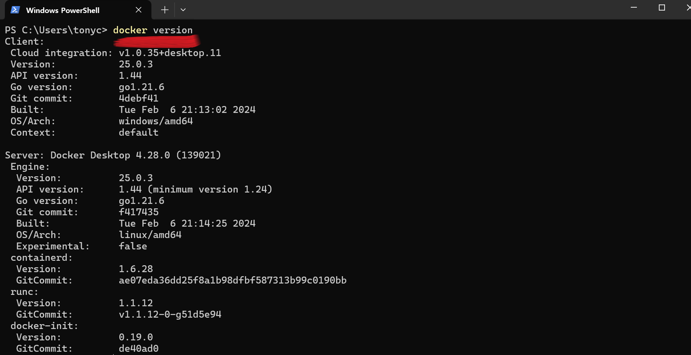
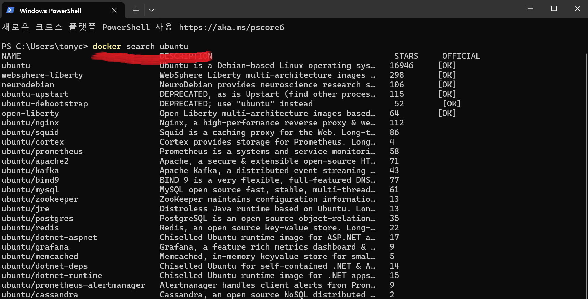
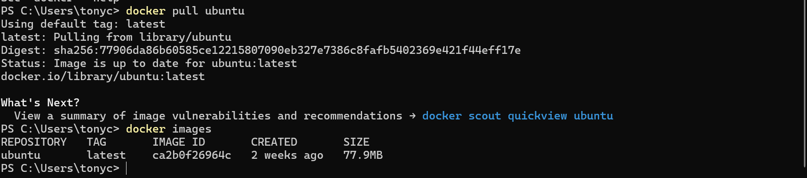
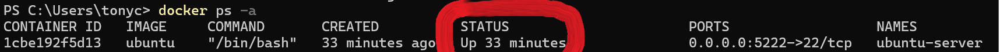
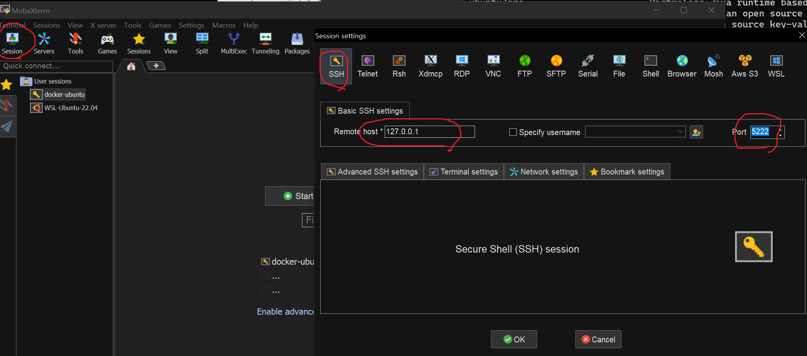

# docker-guide

- [윈도우10에서 우분투 서버 만들기](#윈도우에서-우분투-서버-만들기)


## 윈도우에서 우분투 서버 만들기

윈도우에서 [도커](https://www.docker.com/)를 사용하여 리눅스 우분투 서버를 만들어 개발용으로 사용할 수 있다.

### Docker desktop 설치하기
[https://www.docker.com/products/docker-desktop/](https://www.docker.com/products/docker-desktop/)에서 윈도우용 도커 데스크탑을 다운로드 받아 설치한다. 자세한 설치 방법은 [여기](https://myanjini.tistory.com/entry/%EC%9C%88%EB%8F%84%EC%9A%B0%EC%97%90-%EB%8F%84%EC%BB%A4-%EB%8D%B0%EC%8A%A4%ED%81%AC%ED%83%91-%EC%84%A4%EC%B9%98)를 참고한다.

이제 도커 데스크탑을 실행하면 아래 그림과 같이  `Engine running` 표시를 확인할 수 있다. 그리고 윈도우 cmd 창에서 `docker version`을 입력하여 도커가 정상적으로 설치된 것을 확인할수 도 있다. 

### Ubuntu docker image 다운로드
이제 [도커 허브](https://hub.docker.com/)에서 최신 우분투를 다운로드 받을 수 있다. 도커 데스크 탑이나 cmd창에서 명령줄로 이미지를 다운로드 받을 수 있으며 아래 그림은 cmd창에서 명령줄로 우분투 이미지를 다운로드 받는 방법을 나타낸다. 우선 `docker search ubuntu`명령을 입력하여 다운로드 받을 수 있는 우분투 이미지를 검색할 수 있다.  
이제 `docker pull ubuntu`명령으로 우분투 최신버전을 다운받는다. 그리고 `docker images`명령으로 다운로드 받은 이미지를 확인할 수 있다. 


### Ubuntu 실행하기
`docker run -it -p [port번호]:22 --name [원하는이름] ubuntu` 명령으로 방금 다운받은 이미지를 실행한다. 여기서 `-p [port번호]:22`의미는 우분투 서버에 접근할때 포트번호를 지정하면 22번으로 자동으로 연결하라는 의미이다. 예를 들어, `-p 5222:22`라고 입력한 후 [MobaXterm](https://mobaxterm.mobatek.net/download.html)과 같은 서버 접속 클라이언트를 통해 접속할 때 5222포트를 입력하면 자동으로 22번 포트로 연결되어 SSH가 실행된다.

이제 실제로 윈도우 cmd창에서 아래와 같이 입력하여 실행해보자.
```shell
docker run -it -p 5222:22 --name myubuntu-server ubuntu
```

위의 명령을 입력하면 바로 우분투 서버로 접속된 것을 알 수 있다. 이제 우분투 서버에서 다음 명령을 차례로 입력하여 필요한 툴을 설치한다.

`apt-get update`

`apt-get install net-tools vim openssh-server`

그리고 `vim /etc/ssh/sshd_config`를 입력하여 vim 편집기에서 ssh 설정을 변경해 주어야 한다. 아래 그림과 같이 `PermitRootLgin` 을 찾아 `yes`로 변경해 준다. vim 사용법을 모른다면 구글신에게 물어 보면 간단하게 알 수 있다.
```shell
# default value.

Include /etc/ssh/sshd_config.d/*.conf

#Port 22
#AddressFamily any
#ListenAddress 0.0.0.0
#ListenAddress ::

#HostKey /etc/ssh/ssh_host_rsa_key
#HostKey /etc/ssh/ssh_host_ecdsa_key
#HostKey /etc/ssh/ssh_host_ed25519_key

# Ciphers and keying
#RekeyLimit default none

# Logging
#SyslogFacility AUTH
#LogLevel INFO

# Authentication:

#LoginGraceTime 2m
PermitRootLogin yes
#StrictModes yes
#MaxAuthTries 6
#MaxSessions 10
``` 

`passwd root` 를 입력하여 root 사용자의 비밀번호를 설정한다. 마지막으로 `service ssh start` 를 입력하여 ssh를 재시작 해 준다.

참고로, 윈도우 cmd에서 `docker ps -a`명령으로 실행 하면, 아래 그림과 같이 status가 `up`인 것을 확인할 수 있다.



### 서버에 접속하기
MobaXterm으로 방금 생성한 우분투 서버에 접속한다. 아래 그림과 같이 mobaxterm을 설정해야 한다. `remote host`에는 localhost 즉 `127.0.0.1`을 입력하고 포트에는 위에서 설정한 `5222`를 입력한 후 OK버튼을 누른다.



이제 방금 생성한 session을 실행하면 다음과 같이 로그인 화면에 뜨고 `root`를 입력 후 위에서 설정한 root 사용자의 비밀번호를 입력하면 우분투 서버에 접속이 된다.

이제 리눅스를 사용해 보기 위해 별도의 노트북 필요 없이 윈도우에서 도커를 활용하여 리눅스를 이용해 볼 수 있게 되었다.
